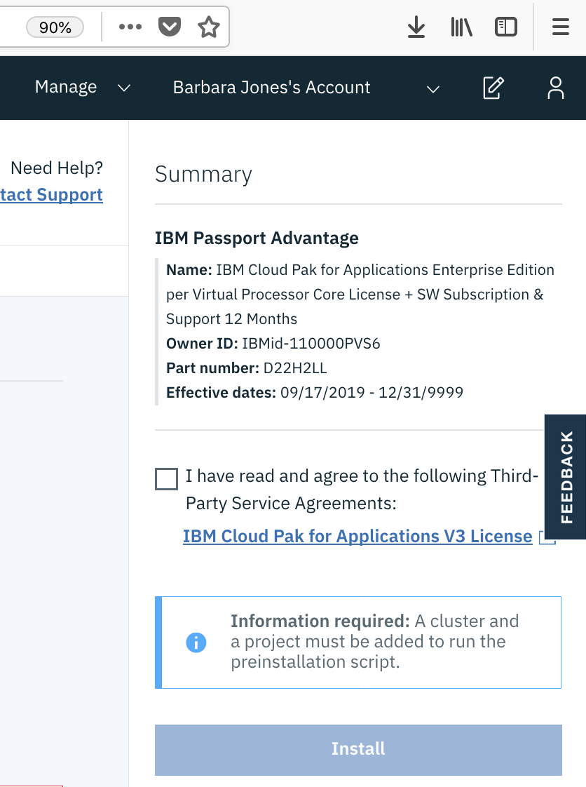
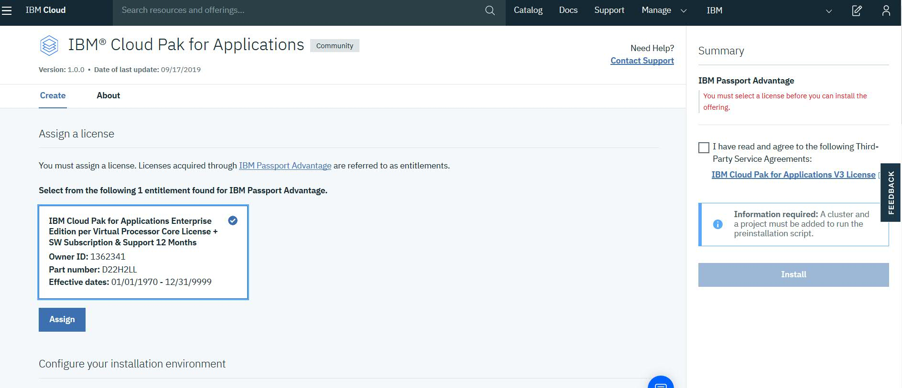

# IBM Access To Entitlement Registry

The following steps are based on the [video](https://ibm.box.com/s/by3ngb7cly9y4w63q6gdazv91e21fi71) provided by Andre Tost. This is a short term solution for a larger issue related to [IBMer access to container images in the entitlement registry](https://github.ibm.com/UnifiedKubeMarketplace/KubeMarketplace/issues/45).

The following instructions involve using a Cloud Pak entitlement in IBM Cloud public to obtain a key to the entitled registry.

**Attention: Please handle the entitlement key with care. Do no expose the key to a customer because it can give them free access to the product.**

## Step 1. Assign Entitlement

Use IBM Cloud public to assign a Cloud Pak entitlement to your account. All IBMers have an entitlement available for each Cloud Pak in IBM Cloud public.  

1. Login to [IBM Cloud](https://cloud.ibm.com/).

1. Use the [catalog to find the Cloud Pak](https://cloud.ibm.com/catalog?search=pak) you want entitlement for and click on the tile. For example, open [IBM Cloud Pak for Applications](https://cloud.ibm.com/catalog/content/ibm-cloud-pak-for-applications).

1. Check if your account already has the entitlement assigned. If it does, you should see the following:

    

    If not, click on the **Assign** button to assign the entitlement to your account. If you are not the account owner, you must have the `Editor` IAM role on the `License and Entitlement` service to assign the entitlement to an IBM Cloud account.

    

## Step 2. Get Entitlement Key

Use the `ibmcloud` CLI and the [pak-entitlement.sh](pak-entitlement.sh) script to get the entitlement key.

**Note:** The `pak-entitlement.sh` requires [ibmcloud](https://cloud.ibm.com/docs/cli/reference/ibmcloud?topic=cloud-cli-install-ibmcloud-cli), [jq](https://stedolan.github.io/jq/), and [curl](https://curl.haxx.se/download.html) tools to be installed.

1. Login to IBM Cloud using the `ibmcloud` tool. Ensure to use the **same account** as before.
   ```
   ibmcloud login
   ```

1. Run the `pak-entitlement.sh list` command to see a list of entitlements associated with your account:
   ```
   ./pak-entitlement.sh list
   ```

   For example, the above command should generate the following output:
   ```
   [
      "IBM Cloud Pak for Applications Enterprise Edition per Virtual Processor Core License + SW Subscription & Support 12 Months"
   ]
   ```

1. Run the `pak-entitlement.sh show-key ENTITLEMENT_NAME` command to get a key for the specified entitlement. The `ENTITLEMENT_NAME` just needs to match part of the entitlement name from the `list` command output. For example:
   ```
   ./pak-entitlement.sh show-key "Pak for Applications"
   ```
   For example, the above command might generate the following output:
   ```
   thahGheezaengie9eishoh3ceit3xeit3xeiquieveem
   ```

## Step 3. Use Entitlement Key

Once you have the entitlement key, you can login to the entitled registry. Specify `ekey` as the username:
```
docker login cp.icr.io --username ekey --password <ENTITLEMENT_KEY>
```

If you need to create a pull secret for the entitlement registry, run the following:
```
oc create secret docker-registry cp-entitlement --docker-server=cp.icr.io --docker-username=ekey --docker-password=<ENTITLEMENT_KEY> --docker-email=unused
```
